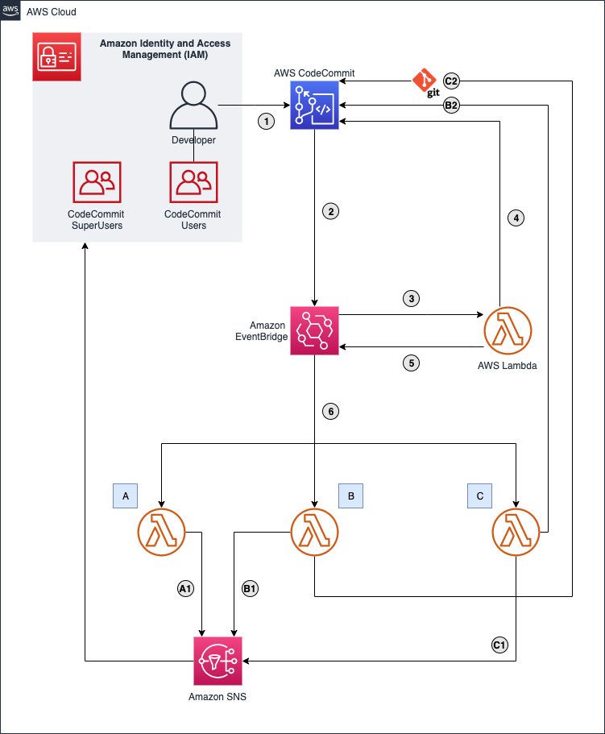
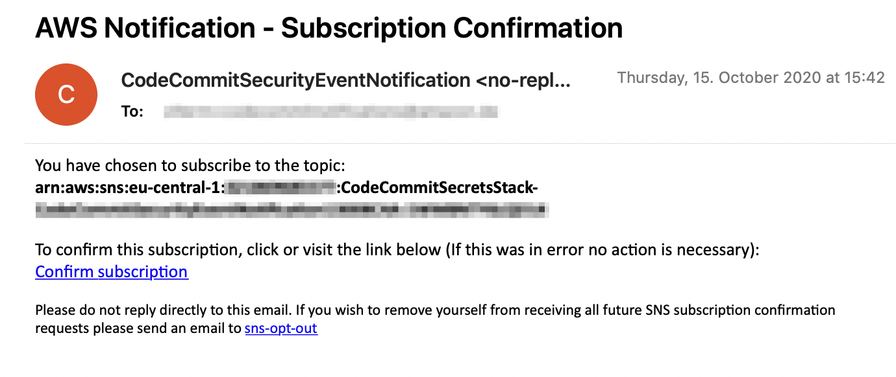
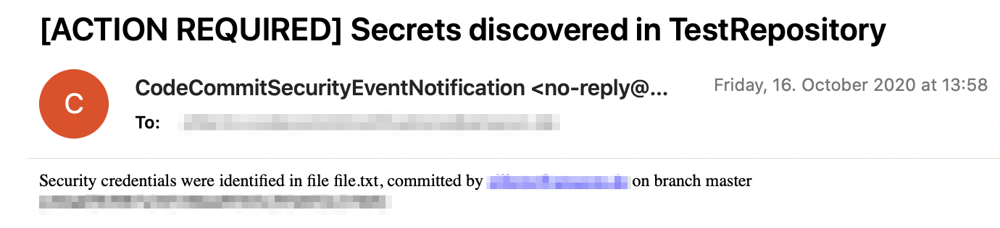
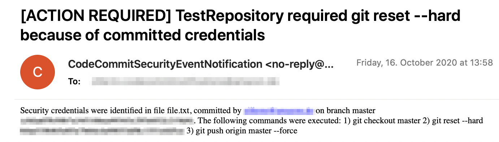
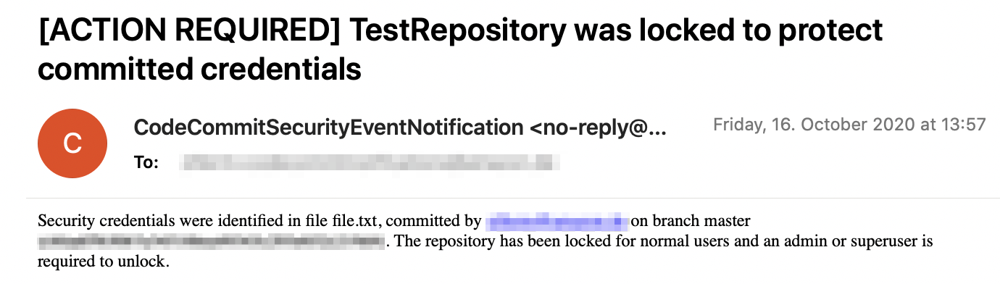

# Discover sensitive data in AWS CodeCommit

This repository contains the full source code that is used in the blog post [Discovering sensitive data in AWS CodeCommit with AWS Lambda](https://aws.amazon.com/blogs/compute/discovering-sensitive-data-in-aws-codecommit-with-aws-lambda).

## Solution Overview




This diagram outlines the workflow implemented in this project:
1.	After a developer pushes changes to CodeCommit, it emits an event to an event bus
2.	A rule defined on the event bus routes this event to a Lambda function 
3.	The Lambda function uses the AWS SDK for JavaScript to get the changes introduced by commits pushed to the repository.
4.	It analyzes the changes for secrets. If secrets are found, it publishes another event to the event bus 
5.	Rules associated with this event type then trigger invocations of three Lambda functions A, B, and C with information about the problematic changes.
6.	Each of the Lambda functions runs a remediation measure:
-	Lambda function A sends out a notification to an SNS topic that informs users about the situation (A1). 
-	Lambda function B locks the repository by setting a tag with the AWS SDK (B2). It sends out a notification about this action (B2).
-	Lambda function C runs git commands that remove the problematic commit from the CodeCommit repository (C2). It also sends out a notification (C1)


### Prerequisites

- An [AWS account](https://signin.aws.amazon.com/signin?redirect_uri=https%3A%2F%2Fportal.aws.amazon.com%2Fbilling%2Fsignup%2Fresume&client_id=signup)
- Installed and authenticated [AWS CLI](https://docs.aws.amazon.com/en_pv/cli/latest/userguide/cli-chap-install.html) (authenticate with an [IAM](https://docs.aws.amazon.com/IAM/latest/UserGuide/getting-started.html) user or an [AWS STS](https://docs.aws.amazon.com/STS/latest/APIReference/Welcome.html) Security Token)
- Installed and setup [AWS Cloud Development Kit (AWS CDK)](https://docs.aws.amazon.com/cdk/latest/guide/getting_started.html)
- Installed Node.js, TypeScript and git


### Let’s get you started

#### 1. Make sure you completed the prerequisites above and cloned this repo.

```
git clone git@github.com:aws-samples/discover-sensitive-data-in-aws-codecommit
```

#### 2. Open the repository in your preferred IDE and familiarize yourself with the structure of the project.

```
.
├── cdk             CDK code that defines the environment
├── img             Images used in this README
└── src
    └── handlers    Handler code of the Lambda functions
```

#### 3. Install dependencies

node.js dependencies are declared in a `package.json`.
This project contains a `package.json` file in two different folders: 
- `cdk`: Dependencies required to deploy your stack with the CDK
- `src.handlers`: Dependencies that support app development, i.e. TypeScript types for the AWS SDK for JavaScript

Navigate to each of the folders and run `npm install`
                             
#### 4. Prepare your environment

Before you can deploy the stack, you need to prepare the environment in `cdk/bin/cdk.ts`

##### Create system user for AWS CodeCommit

**Hint**: Make sure to run the CLI commands in step 1 and 2 in the same AWS account that you will use to deploy the solution via CDK.

1. Create a system user and give it permissions to manage CodeCommit repositories on your behalf.

```
aws iam create-user --user-name CodeCommitSystemUser
aws iam put-user-policy --user-name CodeCommitSystemUser --policy-name ManageCodeCommit --policy-document '{"Version": "2012-10-17", "Statement": [{"Action": "*", "Resource": "arn:aws:codecommit:*", "Effect": "Allow"}]}'
```
2. Generate and store credentials for the system user

Follow these steps to retrieve the git credentials of your system user

- Go to https://console.aws.amazon.com/iam/home#/users.
- Select the `CodeCommitSystemUser`.
- Navigate to the "Security Credentials" tab.
- Generate "HTTPS Git credentials for AWS CodeCommit".
- Download and inspect credentials
- Run the following command to store username and password in AWS Secrets Manager and note the ARN of the secret you created

```
# Make sure to quote <USERNAME> and <PASSWORD>, i.e. '{"user":"someuser","password":"somepw"}'
aws secretsmanager create-secret --name CodeCommitGitCredentials --secret-string '{"user":<USERNAME>,"password":<PASSWORD>}'
```

3. Configure project

- Navigate to `cdk/bin/cdk.ts` and update `secretArn` and `codeCommitSystemUserName` with the values you saved from step 1 and 2.

- Provide an email address where security notifications will be sent


#### 5. Transpile TypeScript to JavaScript

Our CDK and Lambda code is written in TypeScript, an extension to JavaScript that adds static types and other useful features. 

To run our code with the node.js Lambda runtime, we need to transpile the TypeScript into JavaScript, by running `npm run build` in the `cdk` and `src` folder. This will transpile the code once - if you want to keep watching the code for changes and automatically transpile after a change, run `npm run watch`

#### 6. Deploy your application

Navigate to the `cdk` folder and run the following commands

```
cdk synth 
cdk bootstrap
cdk deploy
```

`cdk synth` will synthesize a CloudFormation template from your CDK code. After bootstrapping the required resources for the CDK with `cdk bootstrap` you can then deploy the template with `cdk deploy`.

#### 6. Confirm the SNS Subscription

Check your inbox for an email from _CodeCommitSecurityEventNotification <no-reply@sns.amazonaws.com>_ that looks like this.
 
 
 
 Confirm the subscription to receive notifications for CodeCommit security events.

#### 7. Test the solution

Clone the created repository navigate and run the following commands in the local root of the repository.
 
 The first command will create, commit and push an unproblematic file as an initial commit. The second command will create, commit and push another file with a random string that follows the same pattern as an AWS Access Key.

**Add clean file**
```
echo "Clean file - no credentials here :-)" > clean_file.txt
git add clean_file.txt
git commit clean_file.txt -m "Adds clean_file.txt"
git push
```

**Add problematic file**
```
SECRET_LIKE_STRING=$(cat /dev/urandom | env LC_CTYPE=C tr -dc 'a-zA-Z0-9' | fold -w 32 | head -n 1)
echo "secret=$SECRET_LIKE_STRING" > problematic_file.txt
git add problematic_file.txt
git commit problematic_file.txt -m "Adds secret-like string to problematic_file.txt"
git push
```

After a short while, you will receive 3 email notifications.



 


  


## Cleaning up

When you are done, make sure to clean everything up.

Run the following command to shut down the resources created in this workshop.

```
cdk destroy
```

## License

This library is licensed under the MIT-0 License. See the LICENSE file.


